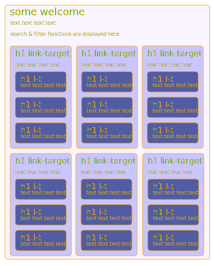

# Make Your School - Material

dieses repository beinhaltet die Dokumentation zu allen Make Your School Materialien.

es gibt eine gerenderte version unter:
https://Make-Your-School.github.io/mks-welcome/

ansonsten stöbere gerne in den verschiedenen Unterordnern.

## Struktur

-   [`public/`](./public/)
    -   [`mks/`](./public/mks/)
        -   [`parts/`](./public/mks/parts/)
            -   [`mks-GroveUltraschall`](./public/mks/parts/mks-GroveUltraschall/)
                -   [`readme.md`](./public/mks/parts/mks-GroveUltraschall/readme.md)
            -   [`mks-Endschalter`](./public/mks/parts/mks-Endschalter/)
                -   [`readme.md`](./public/mks/parts/mks-Endschalter/readme.md)
            -   [`mks-Taster`](./public/mks/parts/mks-Taster/)
                -   [`readme.md`](./public/mks/parts/mks-Taster/readme.md)
            -   ...
        -   [`tags/`](./public/mks/tags/)
            -   [`Entfernung/`](./public/mks/tags/Entfernung)
                -   [`readme.md`](./public/mks/tags/Entfernung/readme.md)
            -   [`Schalter/`](./public/mks/tags/Schalter)
                -   [`readme.md`](./public/mks/tags/Schalter/readme.md)

die Übersichts-seite liegt im Ordner [`public/mks/`](./public/mks/readme.md)
Darunter findest du die verschiedenen bauteile im Ordner [`public/mks/parts/`](./public/mks/parts/).
Jedes Bauteil liegt in einem eigenen Repository welches hier als git submodule eingebunden ist.
Im Ordner [`public/mks/tags/`](./public/mks/tags/) findest du die Erklärungen für alle *Funktions-Gruppen*

die Website folgt in etwa diesem layout

## DEV

für development siehe [./dev.md](./dev.md)
