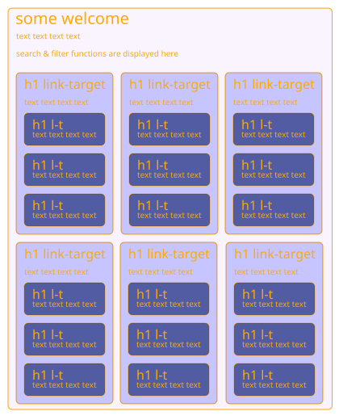

# Make Your School - Material

dieses repository beinhaltet die Dokumentation zu allen Make Your School Materialien.

es gibt eine gerenderte version unter:
https://Make-Your-School.github.io/mks-welcome/

ansonsten stöbere gerne in den verschiedenen Unterordnern.

## Struktur

die Übersichts-seite liegt im Ordner [`public/mks/`](./public/mks/readme.md)
Darunter findest du die verschiedenen bauteile im Ordner [`public/mks/parts/`](./public/mks/parts/).
Jedes Bauteil liegt in einem eigenen Repository welches hier als git submodule eingebunden ist.

Im Ordner [`public/mks/abbr/`](./public/mks/abbr/) findest du die Tool-Tip-Wörter (abbreviations / Abkürzungen).
Alle diese hier verfügbaren Abkürzungen werden automatisch auf der gerenderten Seite mit den Tool-Tips ergänzt.
Der inhalt der Tooltips ist dann der Gerenderte Inhalt aus dem jeweils entsprechenden File.

Im Ordner [`public/mks/tags/`](./public/mks/tags/) findest du die Erklärungen für alle _Funktions-Gruppen_ / tags
(momentan noch ungenutzt.)

- [`public/`](./public/)
    - [`mks/`](./public/mks/)
        - [`parts/`](./public/mks/parts/)
            - [`mks-GroveUltraschall`](./public/mks/parts/mks-GroveUltraschall/)
                - [`readme.md`](./public/mks/parts/mks-GroveUltraschall/readme.md)
            - [`mks-Endschalter`](./public/mks/parts/mks-Endschalter/)
                - [`readme.md`](./public/mks/parts/mks-Endschalter/readme.md)
            - [`mks-Taster`](./public/mks/parts/mks-Taster/)
                - [`readme.md`](./public/mks/parts/mks-Taster/readme.md)
            - ...
        - [`tags/`](./public/mks/tags/)
            - [`Entfernung/`](./public/mks/tags/Entfernung)
                - [`readme.md`](./public/mks/tags/Entfernung/readme.md)
            - [`Schalter/`](./public/mks/tags/Schalter)
                - [`readme.md`](./public/mks/tags/Schalter/readme.md)
            - ...
        - [`abbr/`](./public/mks/abbr/)
            - [`UART.md`](./public/mks/abbr/UART.md)
            - ...

die Website folgt in etwa diesem layout

## contributions

du hast einen Fehler enddeckt?
dann schreibe ihn uns bitte im [issues-tracker](https://github.com/Make-Your-School/mks-welcome/issues)

du magst

- eine änderung in einem Text oder code beispiel machen?
  schau mal in [docu/contributions.md](./docu/contributions.md)
- ein bauteil hinzufügen?
  schau mal in [docu/neues_bauteil_hinzufuegen.md](./docu/neues_bauteil_hinzufuegen.md)

## DEV

für development des renderings ansich siehe [./docu/dev.md](./docu/dev.md)
