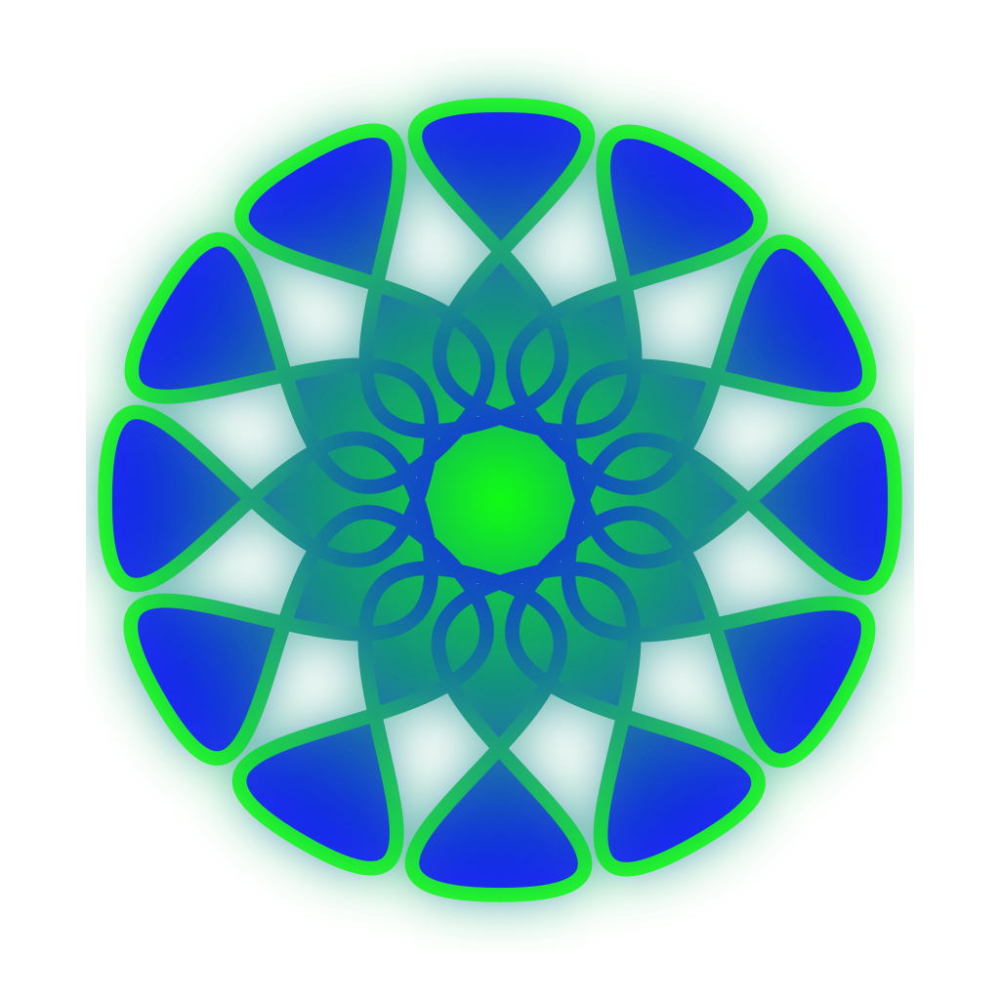

# Demo

Hier ist ein Text / Test um alle verfügbaren Formatierungsoptionen zu testen.
Dies dient auch als Reference :tada:

den sorce-code dieses *readme.md* datei findest du unter

https://github.com/Make-Your-School/mks-welcome/blob/main/public/demo/readme.md?plain=1


ein link mit *titel* geht so: [mks](https://makeyourschool.de/material/)

nun der - momentan ungenutzte - more_details link break.

<!-- more_details -->

dieser Text kommt dann nach dem more_details break..

## Abbr

In diesem Text gibt es einige *Abbreviations* - Abkürzungen. Zum Beispiel HTML. Oder das eher unbekannte W3C.
und mehr MYS relevante UART und natürlich das bei Sensoren sehr häufig genutzte I2C für deren Kommunikation-Schnittstelle.


## Info Boxes...

Diese Box-Typen werden alle unterstützt:

> [!tip]
> This is a tip

> [!notiz]
> Eine Notiz

> [!wichtig]
> Wichtige Informationen für diese Bauteil!

> [!achtung]
> Bitte Vorsichtig sein!

> [!warnung]
> Achtung Achtung!!!!
> ganz wichtig...


## code

code kannst du wie folgt einfügen:
```js
const hello = "world";
let ping = 42;
```

und dann gibt es noch zwei Specials:

### aus datei geladen
Dieser Code-Block sollte aus der Datei example.ino (im gleichen Ordner wie diese readme.md) befüllt sein:
```c++ :./example.ino
// this should be replaced..
```

bei diesem Code-Block existiert die verlinkte datei nicht..
```c++ :./does_not_exist.ino
this does fail.. so we can check a 404 is handled smoothly.
```

und noch ein funktionierendes Beispiel example2.ino here:
```c++ :./example2.ino
// this should be replaced..
```

### alle examples einbinden

mit
```md
!!!show-examples:./examples/
```
kannst du den *automatischen* importer einfügen:
dieser versucht aus dem verlinkten verzeichniss

das Ergebniss solltest du hier sehen:

!!!show-examples:./examples/


## Bilder
Bilder werden mit



eingebunden.


## Überschriften

```md
# Überschrift ersten Grades
## Überschrift zweiten Grades
...
```

## Liste

-   list element
-   list element
-   list element
-   list element
