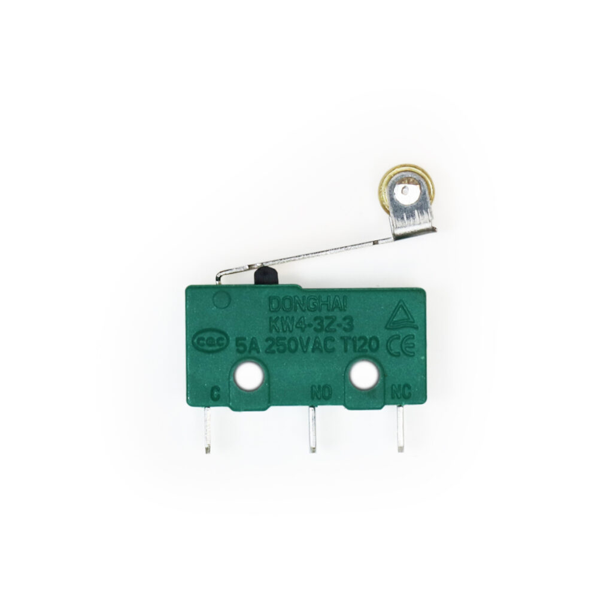

# Endschalter



<!-- TODO: CONTENT change image -->
<!-- TODO: ARCHITECTURE multiple images? -->
<!-- do we need multiple images per part?-->
<!-- and if do we need a slider? -->

## Beschreibung

Der Endschalter funktioniert wie ein normaler Schalter und kann als Eingabe für einen Mikrocontroller verwendet werden.
Der Schalter besitzt einen elastischen Schaltarm, der einen elektrischen Kontakt zwischen den Anschlusspins herstellt, wenn der Arm gedrückt wird.

Der Endschalter kommt vor allem bei Robotern oder anderen bewegten Maschinen zum Einsatz, um Kollisionen zu erkennen und zu vermeiden.
So kann dieser zum Beispiel an einem Roboter angebaut werden - wenn der Roboter dann gegen ein Hindernis fährt,
wird der Endschalter betätigt bevor der Roboter das Hindernis wirklich berührt.
So wird die bevorstehende Kollision erkannt und kann vermieden werden. (z.B. fährt der Roboter dann Rückwärts vom Hindernis weg.)

## Anschlüsse

### Eingang

-   Mechanische Betätigung

### Ausgang

-   3 Kontakte (NC-C-NO)
    -   C = Common (gemeinsamer Anschluss)
    -   NC = Normal Closed (im ungedürckten zustand mit C verbunden)
    -   NO = Normal Open (im gedürckten zustand mit C verbunden)

## Kurz-Datenblatt

-   Schaltleistung: 5A 125VAC

[Hersteller Datenblatt](https://asset.conrad.com/media10/add/160267/c1/-/de/000707243DS01/datenblatt-707243-hartmann-mikroschalter-mbb1-01-a-01-c-09-a-250-vac-5-a-1-x-einein-tastend-1-st.pdf)

## Siehe Auch

-   -

## library

keine library nötig.

## Beispiel

schau dir das Minimal-Beispiel an:

```c++:./examples/Endschalter_minimal/Endschalter_minimal.ino
// this should be overwritten!
```

## Anleitung

-   schließe den Endschalter wie folgt an:
    -   C an GND
    -   NO an D2
-   nehm Beispiel Code
    -   kopiere von hier drüber in neuen leeren arduino sketch
    -   oder direkt über das Menü der Arduino IDE \*1:
        `Datei-Beispiele-MakeYourSchool-Taster-Endschalter-Endschalter_Minimal`
-   Sketch Hochladen
-   Das Sollte nun passieren:
    -   Öffne den Serial-Monitor (Symbol ganz rechts oben in der IDE)
    -   Wenn du nun den Endschalter drückst sollte `Endschalter wurde gerade gedrückt!` angezeigt werden.
    -   Wenn du ihn wieder los lässt sollte `Endschalter wurde wieder geöffnet` angezeigt werden.

\*1: dafür musst du einmalig die `MakeYourSchool` library installiert haben.
diese bringt alle hier im system vorhandenen Beispielcodes in die IDE..
