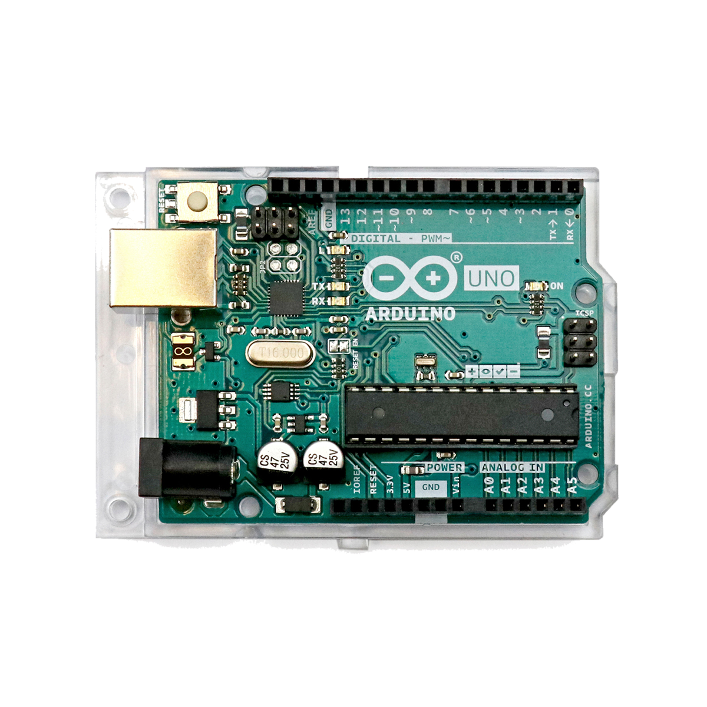

# Arduino UNO

## Beschreibung

Der Arduino UNO ist ein kleiner Computer. Er hat praktisch alles was ein Laptop oder Handy auch hat, nur keine Tastatur oder Bildschirm. Diese Form von Computer nennt man auch Mikrocontroller. Sie sind oft in Geräten verbaut und steuern z.B. Waschmaschinen, Klimaanlagen und solche Dinge. Sie werden oft genutzt um technische Vorgänge zu automatisieren oder miteinander zu koordinieren. Also z.B. bei der Klimaanlage: `Wenn die Temperatur über 30°C steigt, dann schalte die Lüftung an`.

Dafür besitzt der Mikrocontroller viele Ein- und Ausgänge (Inputs und Outputs). 
Diese sind elektrische Anschlüsse, an die verschiedene technische Komponenten, wie Sensoren oder auch Aktoren (Motoren, Leuchten etc.), angeschlossen werden können. Wird der Mikrocontroller entsprechend programmiert, können diese Komponenten logisch miteinander verknüpft werden. Dadurch können die Komponenten gemeinsam eine technische Aufgabe erfüllen.

Man kann es ein bisschen wie der menschliche Körper vergleichen. Der Arduino ist das Gehirn, und wir können Augen und Nase anschließen (Sensoren, um die Umgebung wahrzunehmen) oder Arme und Beine (Aktoren, um die Umgebund zu beeinflussen). Der Code, den wir programmieren ist das was das Gehirn tun will. 

Durch die große Beliebtheit des Arduino in der wachsenden Community lässt sich fast jedes erdenkliche Projekt mithilfe von im Internet veröffentlichten Erfahrungsberichten umsetzen. Es reicht oftmals nur die Komponenten, die man verbinden möchte, in eine Suchmaschine einzugeben, um entsprechende (Video-)Tutorials zu finden.

Der Arduino UNO ist ein Mikrocontroller, der ursprünglich speziell für Bildungszwecke entwickelt wurde. Durch die einfache Programmierung und den niedrigen Preis hat er allerdings sehr schnell auch in anderen Branchen an Beliebtheit gewonnen. Sowohl Wissenschaftler\*innen als auch Studierende, Hobby-Bastler\*innen, DIY-Begeisterte und viele mehr setzen den Mikrocontroller ein, um unterschiedlichste automatisierte Projekte umzusetzen.

### Videos

Hier sind ein paar Videos, die einen Überblick über den Arduino verschaffen

@[youtube](https://www.youtube.com/watch?v=iTs9vjSfEi0)

@[youtube](https://www.youtube.com/watch?v=GQw20v8Qls0)

@[youtube](https://www.youtube.com/watch?v=EEa-0fhb2WA)

<!-- more_details -->

### Programmieren

Um den Arduino zu programmieren (also zu sagen, was er machen soll), muss man Code schreiben. Code ist eine Sprache, die Computer gut verstehen. Hierzu benutzen wir ein bestimmtes Programm. So wie man Text für Menschen in einem Programm wie `Word` schreibt, schreiben wir Text für Computer in einem anderen Programm. Das nennt sich `Arduino IDE`. Wenn es noch nicht offen ist, dann suche es auf deinem Laptop und öffne es.

Ein simples Projektbeispiel ist eine Leuchte, die immer dann aufleuchtet, wenn die Umgebung zu dunkel wird. Hierfür wird ein Lichtsensor benötigt, um das Umgebungslicht zu messen. Der Arduino liest den Sensor aus und steuert schließlich die Leuchte, abhängig von der gemessenen Helligkeit.

## Beispiele

!!!show-examples:./examples/

<!-- infolist -->

## Wichtige Links für die ersten Schritte:

- [Arduino Webseite](https://www.arduino.cc/)
- [Arduino IDE](https://www.arduino.cc/en/Main/Software)
- [Technische Daten zum Arduino UNO](https://store.arduino.cc/arduino-uno-rev3)
- [Programmiersprache](https://www.arduino.cc/reference/de/)
- [Instructables Arduino Class (englisch)](https://www.instructables.com/class/Arduino-Class/)

## Projektbeispiele:

- [Arduino Project HUB (englisch)](https://create.arduino.cc/projecthub)
- [Hackster (englisch)](https://www.hackster.io/arduino/projects)
- [Arduino Tutorial (deutsch)](https://www.arduino-tutorial.de/arduino-projekte/)

## Weiterführende Hintergrundinformationen:

- [Arduino - Wikipedia Artikel](<https://de.wikipedia.org/wiki/Arduino_(Plattform)>)
- [Mikrocontroller - Wikipedia Artikel](https://de.wikipedia.org/wiki/Mikrocontroller)
- [DIY - Wikipedia Artikel](https://de.wikipedia.org/wiki/Do_it_yourself)
- [GPIO - Wikipedia Artikel](https://de.wikipedia.org/wiki/Allzweckeingabe/-ausgabe)
- [I2C - Wikipedia Artikel](https://de.wikipedia.org/wiki/I%C2%B2C)
- [SPI - Wikipedia Artikel](https://de.wikipedia.org/wiki/Serial_Peripheral_Interface)
- [UART - Wikipedia Artikel](https://de.wikipedia.org/wiki/Universal_Asynchronous_Receiver_Transmitter)
