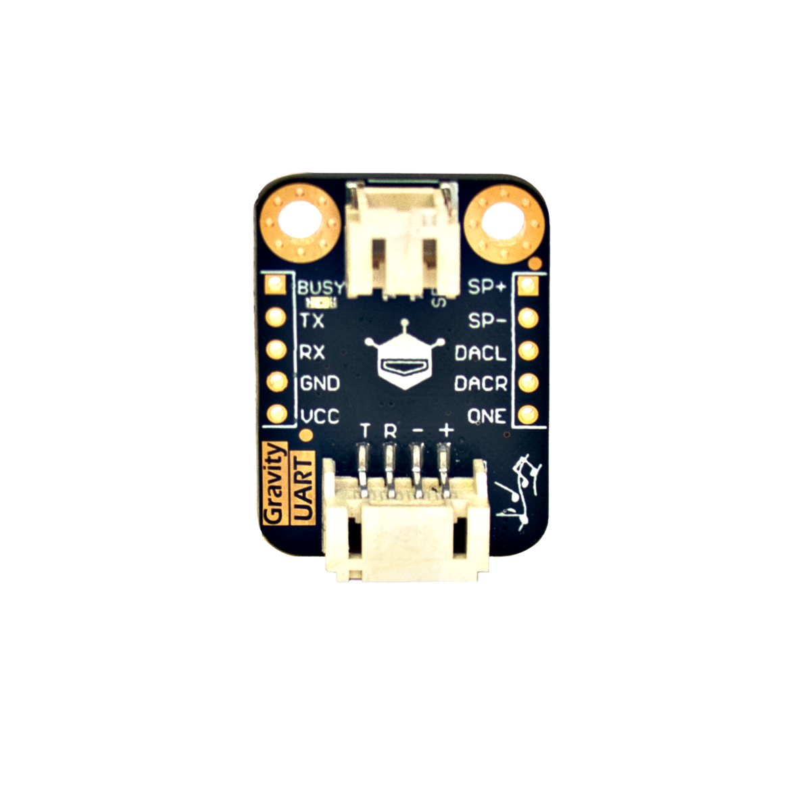
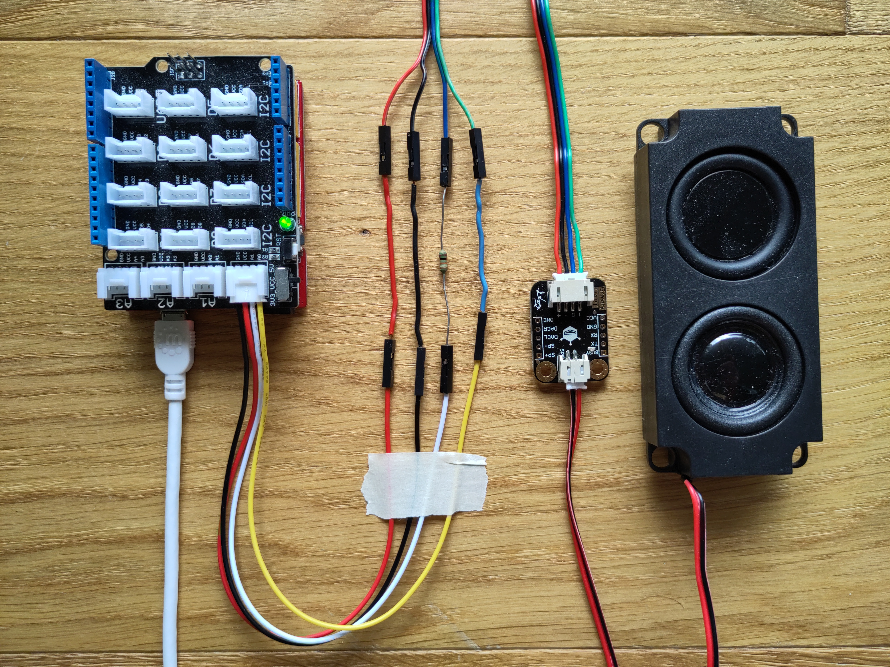

# MP3-Modul

## Beschreibung

Das MP3-Modul ermöglicht das Abspielen von Musik oder abgespeicherten Tönen.

<!-- more_details -->

Es integriert einen Speicherplatz von 8 MB, auf dem Musikdateien im mp3- oder wav-Format über einen Mikro-USB-Anschluss gespeichert werden können.
Um die Musik auszugeben, lässt sich ein Lautsprecher an den dafür vorgesehenen Steckplatz anschließen.

Das Modul wird über die serielle Schnittstelle UART direkt oder mithilfe des Grove Shields an einen Mikrocontroller angeschlossen.

## Anschlüsse

### Eingang

- UART
- USB

### Ausgang

- Audio über Lautsprecher

## Kurz-Datenblatt

- Signal Eingang: 3.3V
- Betriebsspannung: 5V
- Modul-Bezeichnung `DFR0534`
- Main Chip `JQ8400`

## Benutzung / Erste Schritte

### Anschließen

> [!achtung]
> Die Pin-Belegung des Steckers im Modul ist anders als im Grove-System:
> Plus und Minus sind vertauscht!

#### Adapter Kabel

Schnell zusammen gesteckt:

Bitte genau auf die Farbzuordnung achten!!

##### Benötigtes Material

- Beim Modul wird ein Kabel mitgeliefert (Rot, Schwarz, Blau, Grün).
- Kabel: Grove auf Female-Pin-Header (Schwarz, Rot, Weiß, Gelb)
- 10K Widerstand
- Drahtstücke oder _Pin-Header_, die gut in die Buchsen passen.

##### Vorgehen

Stecke die Kabel entsprechend dieser Zuordnung zusammen (siehe Foto):

##### Zuordnung

| Grove   | Verbindung     | MP3-Modul |
| :------ | :------------- | :-------- |
| Rot     | Draht          | Rot       |
| Schwarz | Draht          | Schwarz   |
| Weiß    | 10K Widerstand | Blau      |
| Gelb    | Draht          | Grün      |

- Grove Rot mit Modul Rot
- Grove Schwarz mit Modul Schwarz
- Grove Weiß auf 10k Widerstand auf Modul Blau
    - 10k Widerstand in Leitung die zum Modul RX (Receive = Empfangen = Eingang) führt
    - nötig da das Modul nur 3.3V **Signale** _mag_
    - der Serienwiderstand limitiert den möglichen Strom und schützt so das Modul.
- Grove Gelb mit Modul Grün

#### Adapter Kabel löten

[AdapterLoeten.md](./AdapterLoeten.md)

### Musik aufspielen

Das Modul wird über eine Micro-USB Kabel mit dem Laptop verbunden.
Dann erscheint es als _Massenspeicher_ (_USB-Stick_) im Datei-Explorer.
Über diesen können dann die Sounds im MP3 oder WAV Format auf das Modul kopiert werden.

Bei den Datei-Bezeichnungen bitte darauf achten, dass diese:

- maximal 8 Zeichen haben.
- keine Sonderzeichen enthalten.
- mit einer Nummer beginnen

Zum Beispiel:

- `01BELL.mp3`
- `02DOOR.wav`
- `03DOOR.mp3`

Es stehen maximal 8MB Speicherplatz zu Verfügung.

Du findest [hier im Ordner DFR0534](https://github.com/Make-Your-School/mks-DFRobot-DFR0534/tree/main/sounds) ein paar Beispiel-Sounds, die auch im Beispiel-Code verwendet wurden.

Eine große Auswahl an frei verfügbaren Sound-Effekten findest du auf:
[freesound.org](https://freesound.org)

z. B.

- [allgemeine suche nach _Tür-Glocke_](https://freesound.org/search/?q=door+bell&f=license%3A%22creative+commons+0%22)
- [Klassische Tür-Klingel](https://freesound.org/people/Lynx_5969/sounds/422668/) (Beispiel bell.mp3)

### Programmieren

Bitte die Library `DFR0534` über den Library-Manager installieren.

## Beispiele

!!!show-examples:./examples/

<!-- infolist -->

## Weiterführende Hintergrundinformationen

- [DFRobot Wiki](https://wiki.dfrobot.com/Voice_Module_SKU__DFR0534#target_0)
- [library repository](https://github.com/codingABI/DFR0534)
  Hier findest du die Dokumentation zur Library
  und auch viele weitere Informationen und Möglichkeiten.
- [Datenblatt (grobe übersetzung ins Englische) ](https://sparks.gogo.co.nz/assets/_site_/downloads/JQ8400_English.pdf)
- [UART – Wikipedia Artikel](https://de.wikipedia.org/wiki/Universal_Asynchronous_Receiver_Transmitter)
