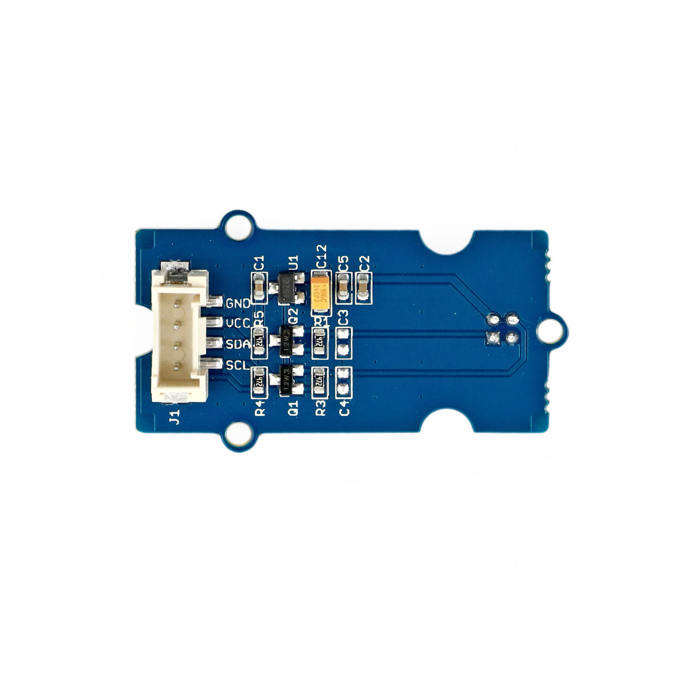

---
title: "Infrarot-Temperatursensor"
date: "2018-10-01T13:46:26.000Z"
tags: 
  - "sensor"
coverImage: "27_infrarot_temperatursensor.jpg"
material_number: "27"
material_type: "sensor"
material_short_descr: "Seeed Studio Grove – Digital Infrared Temperature Sensor"
manufacture: "Seeed Studio"
manufacture_url: "https://www.seeedstudio.com/"
repo_name: "mks-SeeedStudio-Grove_Digital_Infrared_Temperature_Sensor"
product_url: "https://wiki.seeedstudio.com/Grove-Digital_Infrared_Temperature_Sensor/"
clone_url: "https://github.com/Make-Your-School/mks-SeeedStudio-Grove_Digital_Infrared_Temperature_Sensor.git"
repo_prefix: "mks"
repo_part: "Grove_Digital_Infrared_Temperature_Sensor"
embedded_example_file: "examples/Grove_Digital_Infrared_Temperature_Sensor_minimal/Grove_Digital_Infrared_Temperature_Sensor_minimal.ino"
---

# Infrarot-Temperatursensor

## Beschreibung
Dieser Temperatursensor ermittelt die Wärmestrahlung eines beliebigen Gegenstands kontaktlos über infrarotes Licht. Eine Entfernung des zu messenden Objekts von ca. 3cm wird empfohlen. Der Sensor kann direkt oder mithilfe des Grove Shields an einen Arduino angeschlossen werden und kommuniziert standardmäßig über eine serielle Schnittstelle namens SMBus. Er kann ebenfalls über die serielle Schnittstelle I2C ausgelesen werden.

Der Sensor kann zum Beispiel eingesetzt werden, um ein Infrarot-Thermometer aufzubauen.

Alle weiteren Hintergrundinformationen sowie ein Beispielaufbau und alle notwendigen Programmbibliotheken sind auf dem offiziellen Wiki (bisher nur in englischer Sprache) von Seeed Studio zusammengefasst. Zusätzlich findet man über alle gängigen Suchmaschinen durch die Eingabe der genauen Komponentenbezeichnung entsprechende Projektbeispiele und Tutorials.

Die genaue Bezeichnung des Sensors, die bei der Suche von Beschreibungen und Anleitungen wichtig sein kann, lautet MLX90615.

<!-- infolist -->

<!-- infolists -->
## Weiterführende Hintergrundinformationen:

- [I2C - Wikipedia Artikel](https://de.wikipedia.org/wiki/I%C2%B2C)
- [SPI - Wikipedia Artikel](https://de.wikipedia.org/wiki/Serial_Peripheral_Interface)
- [UART - Wikipedia Artikel](https://de.wikipedia.org/wiki/Universal_Asynchronous_Receiver_Transmitter)
- [SMBus - Wikipedia Artikel](https://de.wikipedia.org/wiki/System_Management_Bus)

## Projektbeispiele:

- [Adam Meyer - IR Temperatursensor](http://adam-meyer.com/arduino/MLX90614) (Zeigt die Nutzung mit dem Sensor MLX90615)

## Wichtige Links für die ersten Schritte:

- [Seeed Studio Wiki](http://wiki.seeedstudio.com/Grove-Digital_Infrared_Temperature_Sensor/) [- IR Temperatursensor](http://wiki.seeedstudio.com/Grove-Digital_Infrared_Temperature_Sensor/)
- [GitHub-Repository: Infrarot-Temperatursensor](https://github.com/MakeYourSchool/27-Infrarot-Temperatursensor)

