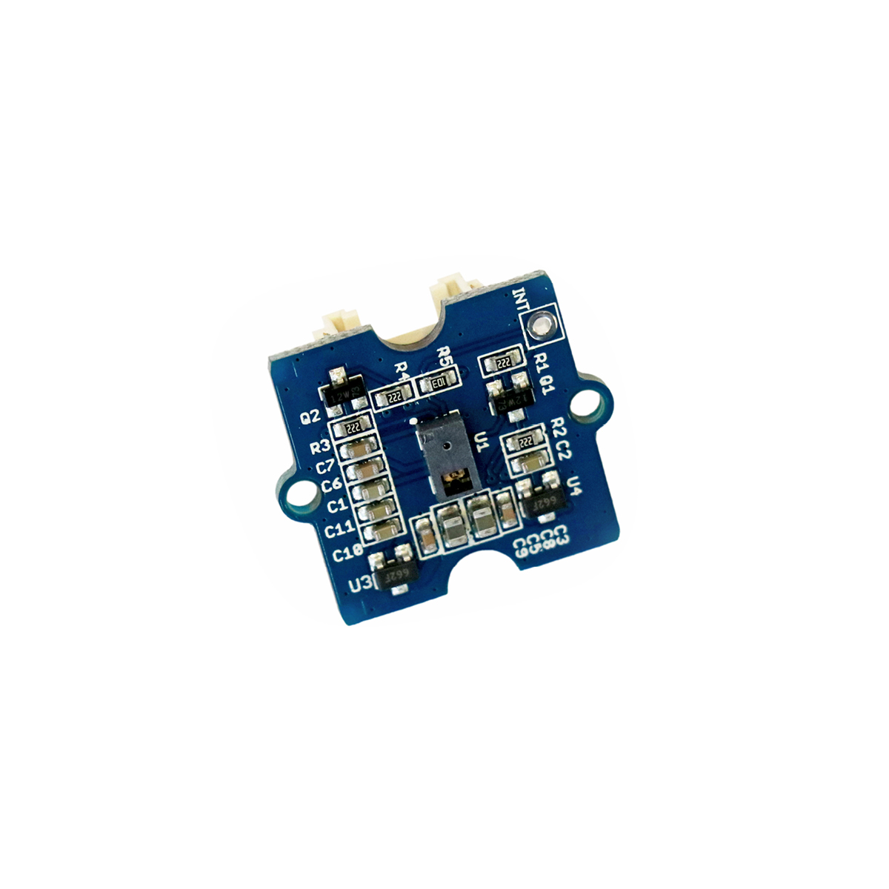

---
title: "Gestenerkennung"
date: "2018-10-01T13:56:33.000Z"
tags: 
  - "sensor"
coverImage: "34_gestenerkennung.jpg"
material_number: "34"
material_type: "sensor"
material_short_descr: "Seeed Studio Grove – Gesture"
manufacture: "Seeed Studio"
manufacture_url: "https://www.seeedstudio.com/"
repo_name: "mks-SeeedStudio-Grove_Gesture_v1.0"
repo_prefix: "mks"
repo_manufacture: "SeeedStudio"
repo_part: "Grove_Gesture_v1.0"
product_url: "https://wiki.seeedstudio.com/Grove-Gesture_v1.0/"
clone_url: "https://github.com/Make-Your-School/mks-SeeedStudio-Grove_Gesture_v1.0.git"
embedded_example_file: "examples/Grove_Gesture_v1.0_minimal/Grove_Gesture_v1.0_minimal.ino"
---

# Gestenerkennung

## Beschreibung
Der Sensor für Gestenerkennung erkennt bis zu neun vorprogrammierte Handbewegungen, die unmittelbar vor oder über ihm ausgeführt werden. Als mögliche Handbewegung ist beispielsweise ein Wischen oder eine Drehbewegung der Finger denkbar. So lässt sich ein angeschlossener Mikrocontroller steuern.

Der Sensor kann direkt oder mithilfe des Grove Shields an einen Arduino oder Raspberry Pi angeschlossen werden. Er kommuniziert hierbei über die serielle Schnittstelle I2C.

Das Modul kann beispielsweise zum Auslösen eines automatischen Seifenspenders eingesetzt werden.

Alle weiteren Hintergrundinformationen, sowie ein Beispielaufbau und alle notwendigen Programmbibliotheken sind auf dem offiziellen Wiki (bisher nur in englischer Sprache) von Seeed Studio zusammengefasst. Zusätzlich findet man über alle gängigen Suchmaschinen durch die Eingabe der genauen Komponentenbezeichnungen entsprechende Projektbeispiele und Tutorials.

Die genaue Bezeichnung des Sensors, die bei der Suche von Beschreibungen und Anleitungen wichtig sein kann, lautet PAJ7620U2.

<!-- infolist -->

<!-- infolists -->
## Wichtige Links für die ersten Schritte:

- [Seeed Studio Wiki](http://wiki.seeedstudio.com/Grove-Gesture_v1.0/) [- Gestenerkennung](http://wiki.seeedstudio.com/Grove-Gesture_v1.0/)

## Projektbeispiele:

- [Hackster - PC per Gestensteuerung kontrollieren](https://www.hackster.io/Momy93/jesty-control-your-pc-with-gestures-5d4a3e)

## Weiterführende Hintergrundinformationen:

- [I2C - Wikipedia Artikel](https://de.wikipedia.org/wiki/I%C2%B2C)
- [SPI - Wikipedia Artikel](https://de.wikipedia.org/wiki/Serial_Peripheral_Interface)
- [UART - Wikipedia Artikel](https://de.wikipedia.org/wiki/Universal_Asynchronous_Receiver_Transmitter)
- [GitHub-Repository: Gestenerkennung](https://github.com/MakeYourSchool/34-Gestenerkennung)

