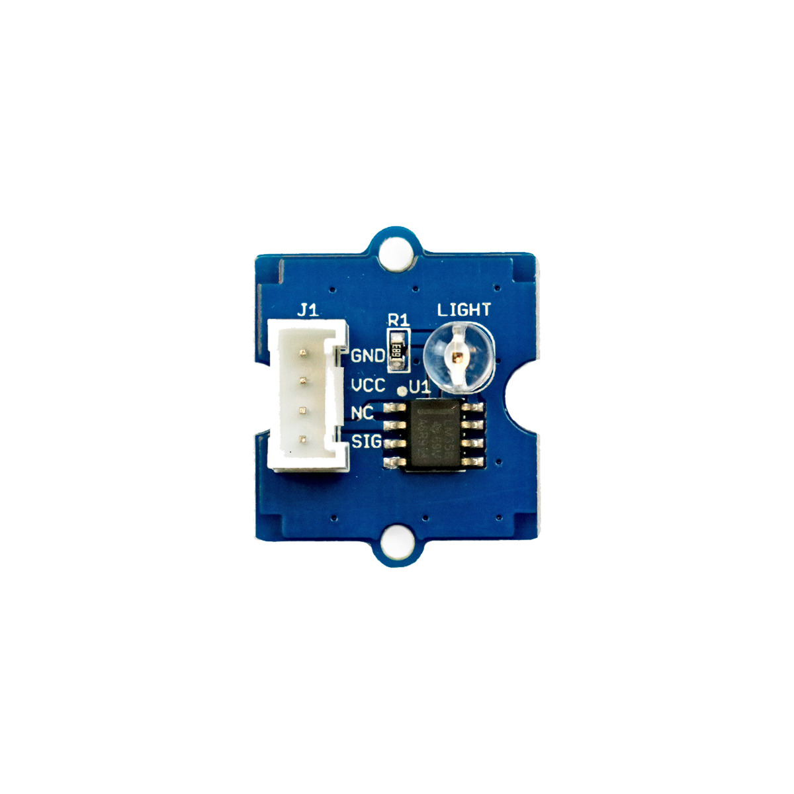

# Helligkeitssensor



## Beschreibung
Der Helligkeitssensor ermittelt die ihn umgebende Helligkeit. Er besteht aus einem Fotowiderstand, der abhängig von der Umgebungshelligkeit seinen Widerstand ändert. Durch die interne Verschaltung gibt der Sensor proportional zu der Helligkeit schließlich eine analogeSpannung aus. Der Sensor kann direkt oder mithilfe des Grove Shields an einen Arduino angeschlossen werden.

Der Helligkeitssensor wird häufig eingesetzt, um Leuchten automatisch bei Dunkelheit anzuschalten.

Alle weiteren Hintergrundinformationen sowie ein Beispielaufbau und alle notwendigen Programmbibliotheken sind auf dem offiziellen Wiki (bisher nur in englischer Sprache) von Seeed Studio zusammengefasst. Zusätzlich findet man über alle gängigen Suchmaschinen durch die Eingabe der genauen Komponentenbezeichnung entsprechende Projektbeispiele und Tutorials.


## Beispiel

schau dir das Minimal-Beispiel an:

```c++:public/mks/parts/mks-SeeedStudio-Grove_Light_Sensor_v1.2/examples/Grove_Light_Sensor_v1.2_minimal/Grove_Light_Sensor_v1.2_minimal.ino
// look in the linked file.
```

<!-- infolist -->

## Wichtige Links für die ersten Schritte:

- [Seeed Studio Wiki](http://wiki.seeedstudio.com/Grove-Light_Sensor/) [- Helligkeitssensor](http://wiki.seeedstudio.com/Grove-Light_Sensor/)

## Projektbeispiele:

- [EXPTech - Lichtsensor](https://www.exp-tech.de/blog/seeed-studio-grove-lichtsensor-projekt)
- [Funduino - Fotowiderstand](https://funduino.de/nr-6-fotowiderstand) [(einzelner](https://funduino.de/nr-6-fotowiderstand) [Fotowiderstand)](https://funduino.de/nr-6-fotowiderstand)

## Weiterführende Hintergrundinformationen:

- [Fotowiderstand - Wikipedia Artikel](https://de.wikipedia.org/wiki/Fotowiderstand)
- [GPIO - Wikipedia Artikel](https://de.wikipedia.org/wiki/Allzweckeingabe/-ausgabe)
- [GitHub-Repository: Helligkeitssensor](https://github.com/MakeYourSchool/30-Helligkeitssensor)


