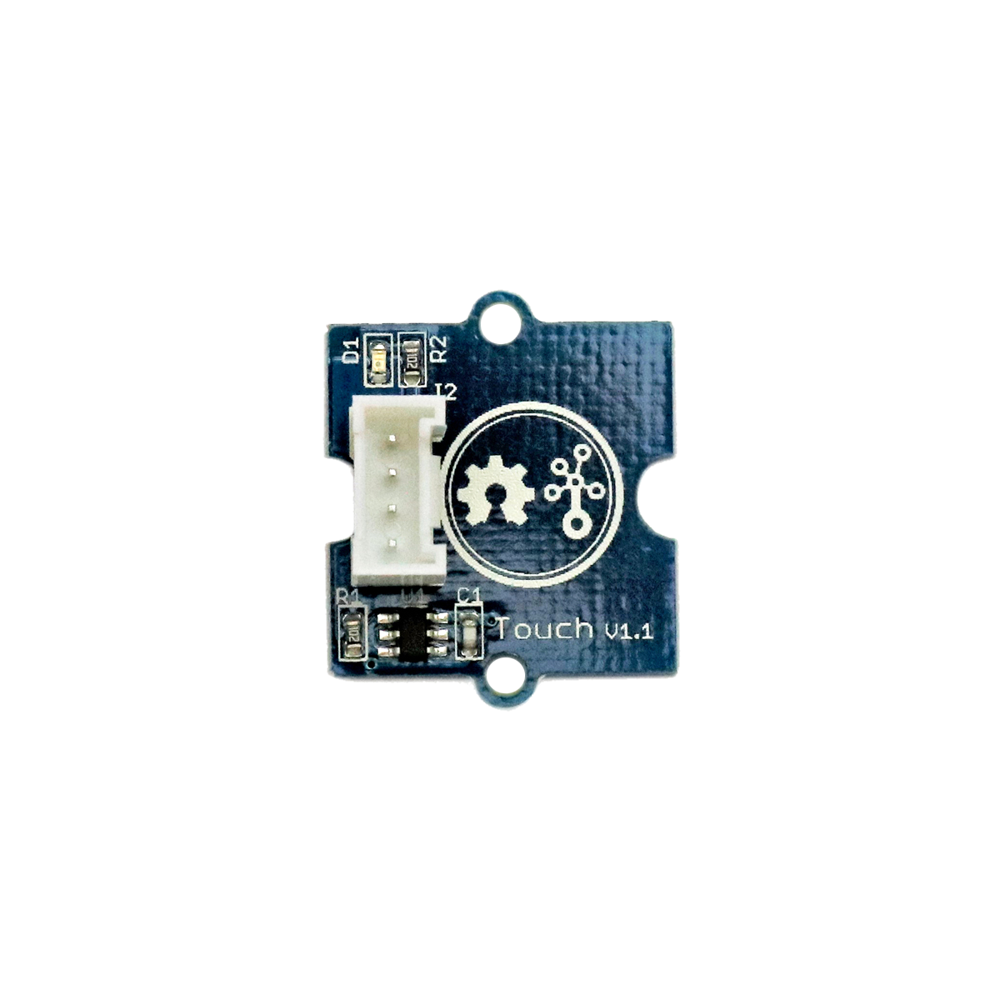

# Berührungssensor

## Beschreibung
Der Berührungssensor erkennt, sobald sich ein Finger dem Sensor nähert. Dabei spielt es keine Rolle, ob der Finger den Sensor tatsächlich berührt oder dieser sich nur knapp darüber befindet. Er hat damit eine ähnliche Funktion wie ein Taster oder Schalter und kann einen Mikrocontroller steuern. Der Sensor lässt sich direkt oder mithilfe des Grove Shields an einen Arduino oder Raspberry Pi anschließen. Die erkannte Berührung (oder Annäherung) wird über ein digitales Signal ausgegeben.

Alle weiteren Hintergrundinformationen sowie ein Beispielaufbau und alle notwendigen Programmbibliotheken sind auf dem offiziellen Wiki (bisher nur in englischer Sprache) von Seeed Studio zusammengefasst. Zusätzlich findet man über alle gängigen Suchmaschinen meist nur mit der Eingabe der genauen Komponenten-Bezeichnungen entsprechende Projektbeispiele und Tutorials.

## Beispiele

!!!show-examples:./examples/

<!-- infolist -->

## Wichtige Links für die ersten Schritte:

- [Seeed Studio Wiki](http://wiki.seeedstudio.com/Grove-Touch_Sensor/) [- Touchsensor](http://wiki.seeedstudio.com/Grove-Touch_Sensor/)

## Weiterführende Hintergrundinformationen:

- [GPIO - Wikipedia Artikel](https://de.wikipedia.org/wiki/Allzweckeingabe/-ausgabe)
- [GitHub-Repository: Berührungssensor](https://github.com/MakeYourSchool/56-Beruehrungssensor)

