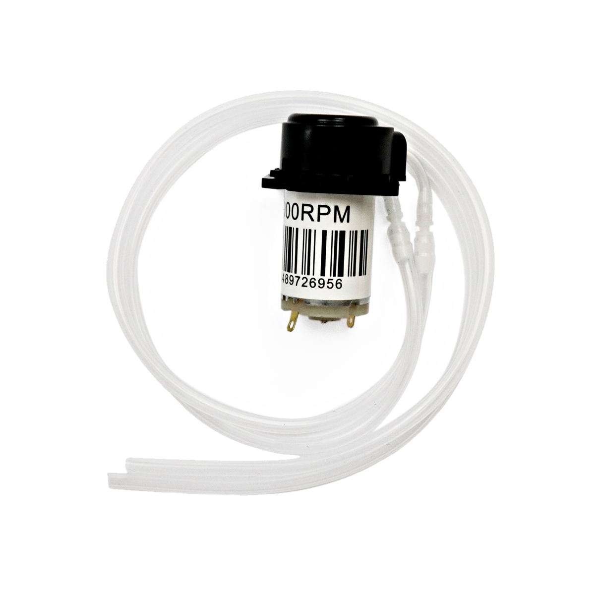

# Peristaltikpumpe

## Beschreibung
Die Peristaltikpumpe bringt durch Kneten eines Silikonschlauchs die darin befindliche Flüssigkeit in Bewegung und drückt diese so durch den Schlauch hindurch. 
Dabei kommen die mechanischen Bauteile der Pumpe nicht mit der Flüssigkeit in Kontakt und so lässt sie sich auch für Getränke oder andere flüssige Nahrungsmittel oder sterile Flüssigkeiten nutzen. 

Da die Pumpe durch einen [Gleichstrommotor](/mks-welcome/part/mks-generic-DCMotor_130/) angetrieben wird, wird sie auch wie dieser angeschlossen. 

Die Steuerung erfolgt über ein einfaches Relais, einen Transistor, einen manuellen Schalter oder einen Motortreiber.

Falls du den Motor vom Arduino nur Ein und Aus Schalten möchtest, nutze einfach das [Relay](/mks-welcome/part/mks-SeeedStudio-Grove_Relay/).
Wenn eine Steuerung der Geschwindigkeit oder Drehrichtung nötig ist, verwendest du am besten den [Motortreiber](/mks-welcome/part/mks-SeeedStudio-Grove_I2C_Motor_Driver_V1.3/).
Schaue dort nach dem Beispiel für `DC-Motor`.

Die Peristaltikpumpe kann zur Bewässerung von Pflanzen oder zum Aufbau eines Wasserspenders eingesetzt werden.

## Beispiele

!!!show-examples:./examples/

<!-- infolist -->

## Wichtige Links für die ersten Schritte:

- [Adafruit Wasserpumpe](https://www.adafruit.com/product/1150)

## Weiterführende Hintergrundinformationen:

- [Peristaltikpumpe - Wikipedia Artikel](https://de.wikipedia.org/wiki/Schlauchpumpe)

