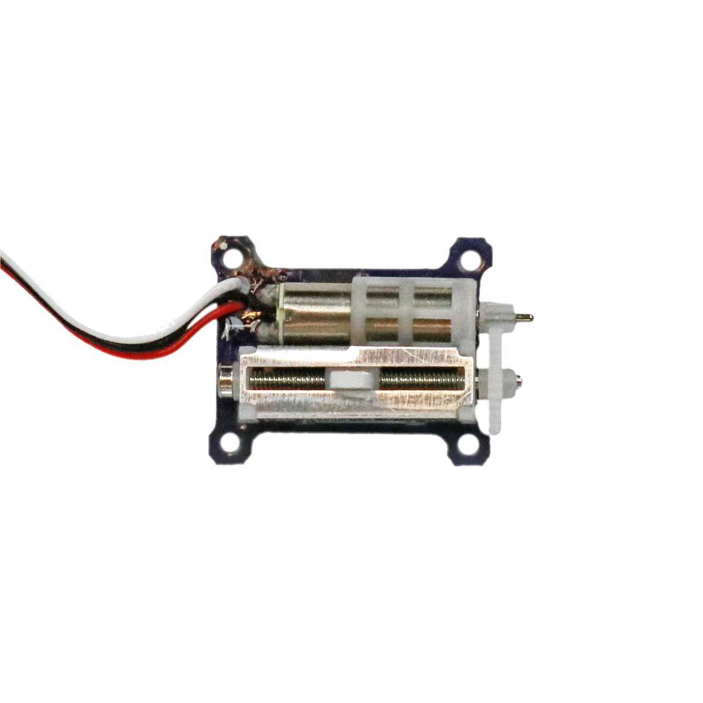

# Linearservomotor



## Beschreibung
Ein Servomotor verfügt über eine interne Regelung, sodass von außen nur eine Position angeben werden muss, die er dann selbstständig anfährt und hält (trotz Krafteinwirkung). Er kann dadurch nur genaue Positionen anfahren, ist aber nicht für endloses Drehen ausgelegt. Ein Servomotor wird direkt oder mithilfe des Grove Shields an einen Arduino angeschlossen und über Pulsweitenmodulation (PWM) angesteuert.

Der Linearservomotor ist ein spezieller Servomotor, der für lineare Bewegungen konzipiert ist. Er kann somit kleine Vor- und Rückwärtsbewegungen ausführen.

Entsprechende Projektbeispiele und Tutorials sind über alle gängigen Suchmaschinen durch die Eingabe der genauen Komponentenbezeichnungen zu finden. Hierbei ist die Eingabe des Stichworts „Linear Servomotor“ entscheidend.


## Beispiel

schau dir das Minimal-Beispiel an:

```c++:public/mks/parts/mks-generic-mico_linear_servo/examples/mico_linear_servo_minimal/mico_linear_servo_minimal.ino
// look in the linked file.
```

<!-- infolist -->

 

https://www.youtube.com/watch?v=wVxcmO2YuxA

 

## Wichtige Links für die ersten Schritte:

- [Conrad - Produktseite](https://www.conrad.de/de/micro-servo-s-15-linear-sol-expert-s15jst-05-s-404224.html)

## Projektbeispiele:

- [Arduino Tutorial - Servo](https://www.arduino-tutorial.de/servo/)

## Weiterführende Hintergrundinformationen:

- [Pulsweitenmodulation - Wikipedia Artikel](https://de.wikipedia.org/wiki/Pulsweitenmodulation)
- [GPIO - Wikipedia Artikel](https://de.wikipedia.org/wiki/Allzweckeingabe/-ausgabe)
- [Servomotor - Wikipedia Artikel](https://de.wikipedia.org/wiki/Servomotor)


