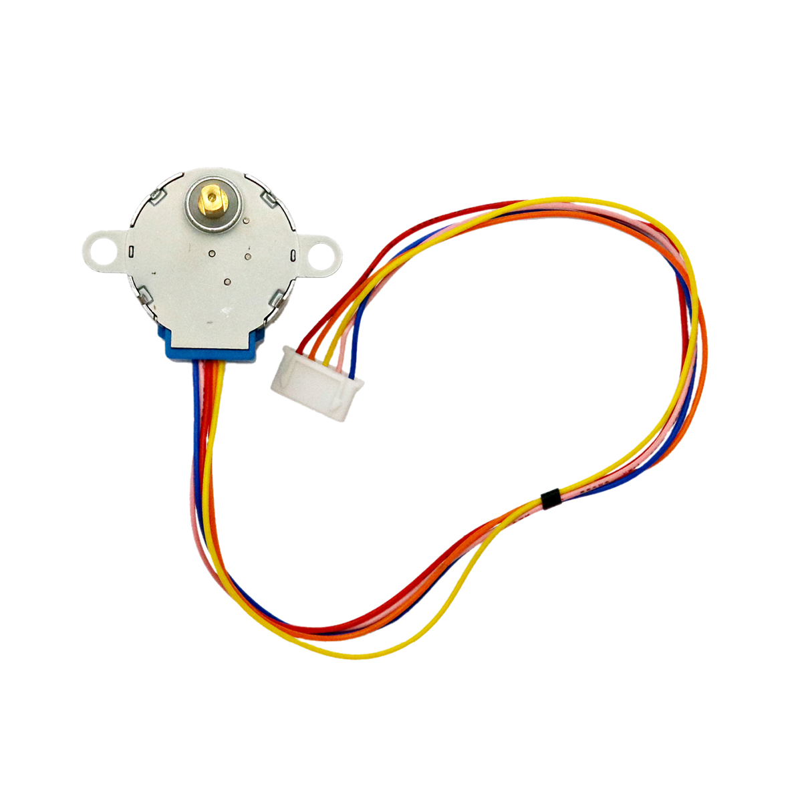
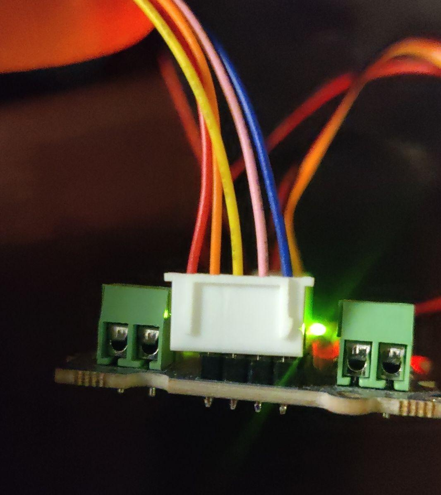
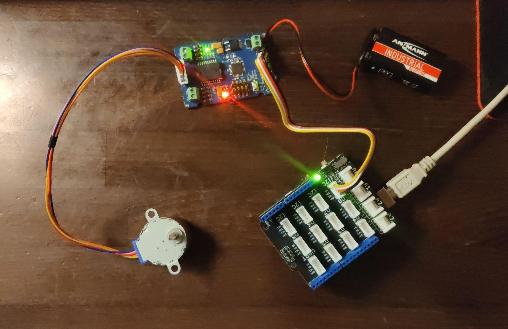

# Schrittmotor

## Beschreibung

Ein Schrittmotor (englisch: *stepper motor*) wird immer mithilfe eines Motortreibers angesteuert. 
Er kann sehr genau positioniert werden, selbst ohne Sensoren, da er in einzelnen, unabhängig von äußeren Belastungen, immer gleichbleibenden Schritten weiterdreht (innerhalb der angegeben Belastungsgrenze). 
Praktisch bedeutet das: Der Mikrocontroller sendet an den Motortreiber die Richtung und die Anzahl an Schritten, die weitergedreht werden sollen. 
Solange man die Anfangsposition kennt und den Überblick der vorwärts und rückwärts gedrehten Schritten behält, ist die Position des Motors bekannt. 
Der Schrittmotor ist dadurch sehr präzise, dafür relative langsam.

Ein Schrittmotor kommt durch seine genaue und einfache Positionierbarkeit oft in der Bewegung von Maschinen oder Robotern zum Einsatz.

Weitere Informationen bezüglich der Ansteuerung sind beim [Motortreiber](/mks-welcome/part/mks-SeeedStudio-Grove_I2C_Motor_Driver_V1.3/) Beispiel `Stepper-Motor` zusammengefasst.

## Video

@[youtube](https://www.youtube.com/watch?v=wVxcmO2YuxA)

## Schritt für Schritt Anleitung

1. Nimm einen [Motortreiber](/mks-welcome/part/mks-SeeedStudio-Grove_I2C_Motor_Driver_V1.3/) und schließe ihn mit einem Grove-Kabel an eine `I2C`-Schnittstelle des Arduinos an. 
1. Verbinde den Schrittmotor mit dem Motortreiber wie auf dem Bild dargestellt. 
    Es gibt fünf Kabel und nur vier Pins: Das rote Kabel bleibt ohne Kontakt. (*steckt neben* dem Stecker)
    
1. prüfe das der Motortreiber vom Arduino mit Strom mit versorgt wird.
    dafür muss die Steckbrücke **neben** der Power-EingangsKlemme *gebrückt* sein.
    (z.B. mit einem *weiblich-weiblich* Jumper-Kabel)
<!-- 1. Schließe eine Batterie an den Motortreiber. Nimm dazu eine 9V-Blockbatterie und einen Batterieclip. Es sollte in etwa so aussehen:  
     -->
1. Öffne die Arduino IDE und klicke am linken Rand auf das Symbol mit den Büchern (das ist der Bibliotheksverwalter). 
    - Suche nach `Grove I2C Motor Driver`
    - klicke anschließend auf Installieren
    - Das ist eine Bibliothek mit Code, mit der man den Motortreiber steuern kann.
1. Nimm den untenstehenden Code und lade ihn auf den Arduino hoch. 
1. Der Motor sollte sich nun abwechselnd hin- und herdrehen.
    - spiele mit den Werten in `Motor.StepperRun(512);` 
    - finde heraus wie viele *Schritte* es braucht damit die Welle sich genau einmal herum dreht.

## Beispiele

!!!show-examples:./examples/

<!-- infolist -->

## Wichtige Links für die ersten Schritte:

Weitere Hintergrundinformationen, ein Beispielaufbau und alle benötigten Programmbibliotheken lassen sich über gängige Suchmaschinen finden, indem man die genauen Komponentenbezeichnungen eingibt.

- [Adafruit Schrittmotor](https://www.adafruit.com/product/858)
    - hier findest du Bilder wie der Steppermotor innen aussieht.
- [Seeed Studio Wiki – Motortreiber](http://wiki.seeedstudio.com/Grove-I2C_Motor_Driver_V1.3/)

## Projektbeispiele:

- [Funduino - Schrittmotor](https://funduino.de/nr-15-schrittmotor)

## Weiterführende Hintergrundinformationen:

- [GPIO - Wikipedia Artikel](https://de.wikipedia.org/wiki/Allzweckeingabe/-ausgabe)
- [Schrittmotor - Wikipedia Artikel](https://de.wikipedia.org/wiki/Schrittmotor)

