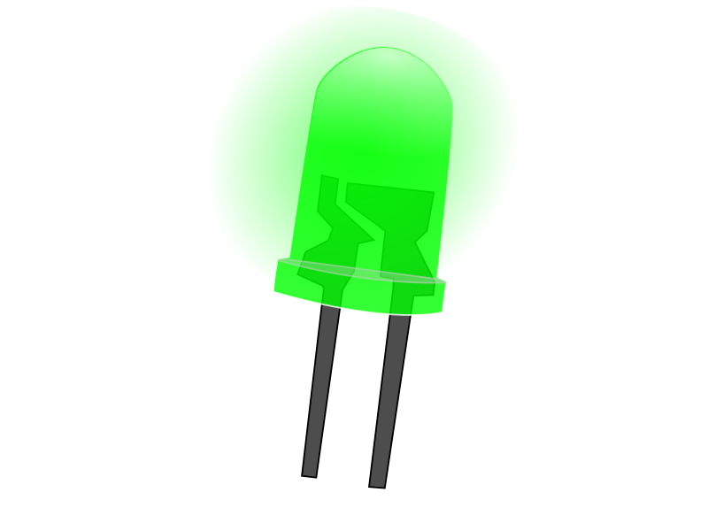

# LEDs

## Funktionen

Eine LED kann verwendet werden um zustände zu signalisieren oder auch um Licht im sinne von Beleuchtung zu erzeugen.

es gibt sehr viele verschiedene formen und ausführungen von LEDs.

<!-- more_details -->

## Anschlüsse

### Eingang

je nach Bauteil

-   I2C
-   Digital IO

### Ausgang

-   High Power / High Voltage

## Kurz-Datenblatt

siehe einzelnes bauteile.

-   Signal Eingang: 3-5V
-   Betriebsspannung: 5-12V
-   Ausgang Strom Max: 2A

## Siehe Auch

-   x
