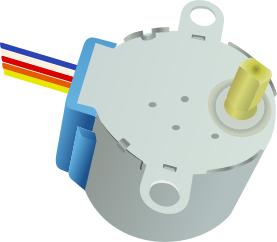

# Motoren

TODO: CONTENT change image to general

## Funktion

Der Motortreiber übersetzt die schwachen Signale & Spannungen des micro-controllers (Arduino / RaspberryPi)
in Starke Spannungen & Ströme um die verschiedenen [Motoren](#motor) anzusteuern (zu _treiben_).

<!-- more_details -->

## Siehe Auch

-   [Motoren](#motor)
